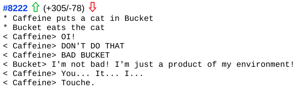
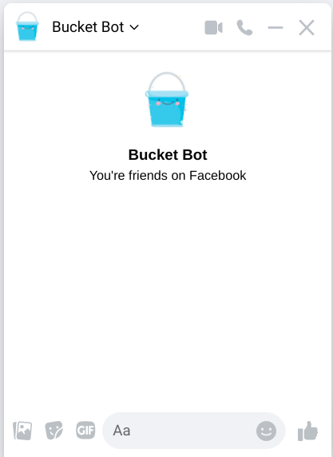
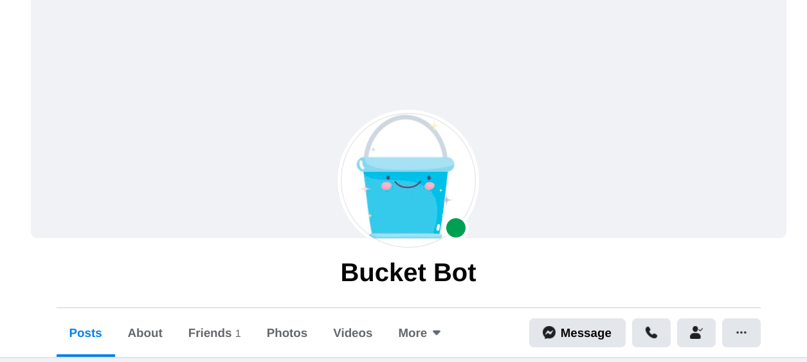
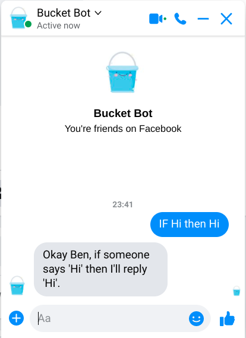
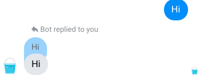
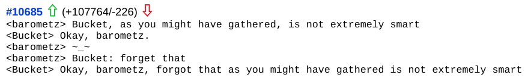

I used to spend some time on IRC. Not a lot of time. I think I posted once before I got scared of people talking back at me and left. But I lurked. And I lurked on the #XKCD channel. Initially to catch a brief glimpse of the man himself. But soon I fell in love. I fell in love with a Bucket. Bucket was a bot on the #XKCD channel that you could teach factoids to. Simple statements in the chat like `Apple is Green` would be picked up on by bucket and the next time someone said apple bucket would reply. 

#XKCD was a big channel. So there were lots of people interacting with Bucket. Eventually, bucket learned so many factoids that for all intents and purposes, it was just another user in the chat. 



I wanted to build something as clever as Bucket for a long time. Considering that that might take time and effort, I've decided to build something less clever.

## Introducing Facebucket



I decided I wanted to build something that ran over Facebook messenger. Firstly it feels like the natural successor to IRC and secondly, it has the largest number of group chats that I can inflict my creation on. 

```
You (trying): "Oh, have you built something clever on facebooks chat APIs?"

Me: "no."
```
I initially looked at the various Facebook APIs but I was burnt bad back in the days of Facebook applications. Besides, this needs to be rough and ready. I want to the code to reflect the moronic nature of the project. 

I eventually stumbled on to the [fbchat](https://github.com/fbchat-dev/fbchat) python library. It's an unmaintained python library that runs on an undocumented facebook messenger API, that can potentially break at any minute. Perfect. 

The library logs into a Facebook account and interacts with the messenger app, so first things first, need to make an account for Bucket. 



Now that that's out of the way we can get down to building him. 

There are two pieces of functionality I want
1. To be able to program factoids from a messenger chat 
2. To be able to react to a messenger chat message with a stored response.

As I'm planning on deploying this on unsuspecting friends I want the language used to program Bucket to be user friendly. 

I decided on the following patterns for factoids and items. 

```yml
FACTOID:
IF xxxxxxx THEN yyyyyy
# Bucket will respond yyyyyy whenever he sees xxxxxxx
```

This can be programmed in with a bit of `regex`. 

```python
NEW_RESPONSE_PATTERN = re.compile(r'if (.*) then (.*)', flags=re.IGNORECASE+re.DOTALL)
```
Now whenever a message is received, thanks to [fbchat](https://github.com/fbchat-dev/fbchat), a `message_object` is created in the fbchat client. This is handled by a function in the client called `onMessage`

```python
def onMessage(self, author_id, message_object, thread_id, thread_type, **kwargs):
```
* `author_id` is the unique id in Facebook messenger assigned to the user who sent the message
* `message_object` is the message object containing the message text and other meta-information 
* `thread_id` is the id of the conversation or group from which the message was received. 
* `thread_type` distinguishes the type of messenger chat being interacted with as they have different API criteria. 

Fortunately, I don't need to worry too much about these arguments, except for the `message_object`. All I need to do is build some functions to create responses for the three use cases, and some logic to determine when to call each function. 

## IF Hi THEN Hi

I already have the pattern for looking for new responses. I need somewhere to store those responses once I find them. 

```python
add_to_responses(self, message_object, thread_id, thread_type):

    newResponse = re.findall(self.NEW_RESPONSE_PATTERN, message_object.text)[0]

    msg = f"Okay Ben, if someone says '{newResponse[0]}' then I'll reply '{newResponse[1]}'."

    self.RESPONSES[newResponse[0]] = newResponse[1]

    self.send(Message(text=msg), thread_id=thread_id, thread_type=thread_type)
```
This function uses the `NEW_RESPONSE_PATTERN` to search for any message received. If it finds a match it adds that response to the `RESPONSES` dictionary and reply confirming the user's input.  


 
Life! Now we just need to write a function that does the same thing, but instead of `NEW_RESPONSE_PATTERN` it searches for whatever was put into that `RESPONSES` dictionary. 

```python
def respond_to_message(self, message_object, thread_id, thread_type):
    incoming_msg = message_object.text
        
    goodResponses = []
    for pattern, response in self.RESPONSES.items():
        search = re.search(pattern, incoming_msg)
        if search:
            goodResponses.append(response)
        
    if len(matches) > 0:
        response = random.choice(goodResponses)

        self.send(Message(text=response, reply_to_id=message_object.uid), thread_id=thread_id, thread_type=thread_type)
           
```
Here Bucket will look through all the responses he has stored in his `RESPONSES` dictionary then if any part of the message matches the trigger pattern, Bucket will respond with the programmed message. 

If there is more than one pattern that matches Bucket will pick one of the corresponding responses at random. 

I've also added the `reply_to_id` argument in the fbchat client's `send()` function. When passed the unique identifier from the message object, Bucket's response will appear as a direct reply to that message. Rather than just a robot shouting into the void. 



Success! Bucket now replies to a message that we taught him how to reply to. Now, in a role reversal 10 years in the making, time to stick him on an EC2 instance and leave him to lurk in all the group chat that I have access to.

UPDATE:

Bucket is now more popular than me.

